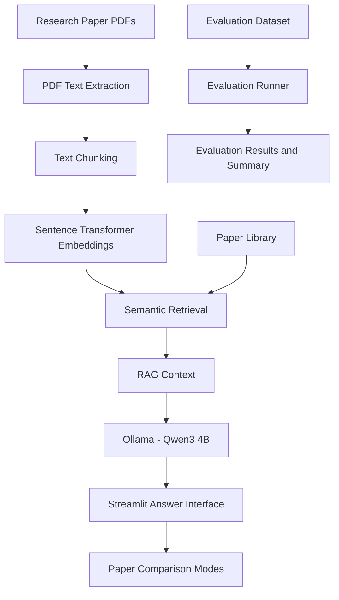

# ResearchPilot AI — Architecture

```mermaid
flowchart TD
    A[Research Paper PDFs] --> B[PDF Text Extraction]
    B --> C[Text Chunking]
    C --> D[Sentence Transformer Embeddings]
    D --> E[Semantic Retrieval]
    E --> F[RAG Context]
    F --> G[Ollama - Qwen3 4B]
    G --> H[Streamlit Answer Interface]

    I[Paper Library] --> E
    H --> J[Paper Comparison Modes]
    K[Evaluation Dataset] --> L[Evaluation Runner]
    L --> M[Evaluation Results and Summary]
```
